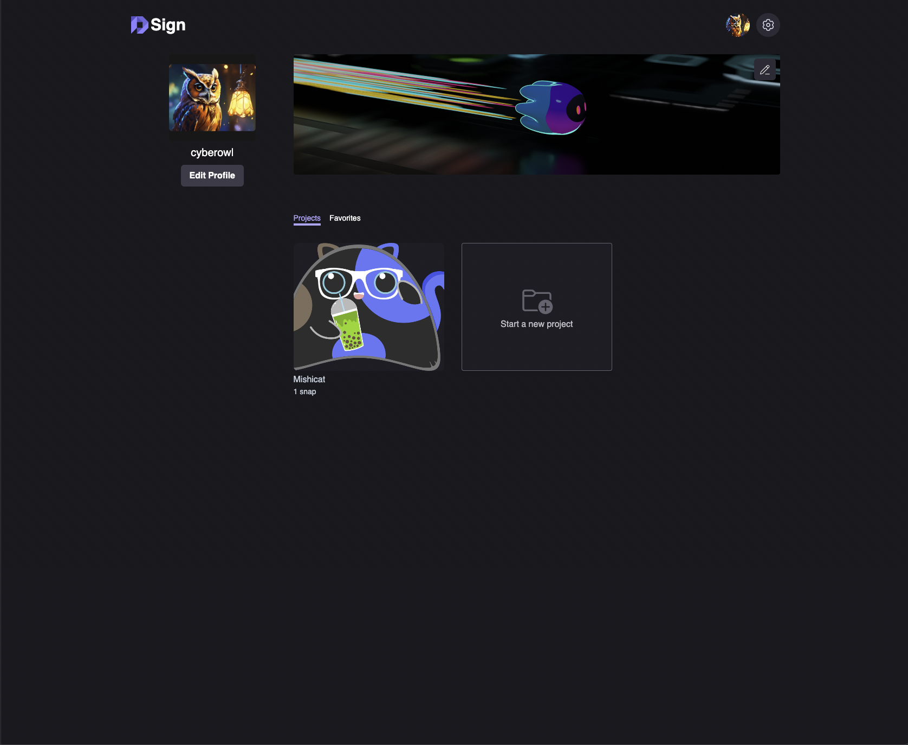

# DSign

Welcome to **DSign** – the Collaborative Product Design Innovation Hub.

Experience a blend of creativity and technology, empowering designers to transform innovative ideas into reality.



## Quick Links

- [Components Library UI](https://github.com/cybrowl/dsign-components)

## Getting Started

Follow these steps to set up your environment and start contributing to DSign:

1. Start the development server with a clean slate:

   ```shell
   dfx start --clean
   ```

2. Initialize the project:

   ```
   npm run boot
   ```

## Canister Testing

To verify that your contributions are reliable, please run the canister tests:

`npm run test`

## Environment Configuration

1. Create a .env file at the root of the project.
2. Add the following environment variables for deployment and identity management:

```
DEPLOY_ENV=local

# Profile Creation Identities

MOTOKO_IDENTITY=
MISHICAT_IDENTITY=

# Profile Images Identities

NOVA_IDENTITY=
DAPHNE_IDENTITY=

# Projects without Snaps Identities

OWL_IDENTITY=
DOMINIC_IDENTITY=

# Projects with Snaps Identities

NIKOLA_IDENTITY=
LINKY_IDENTITY=
```

## Random Identity

Generate a random identity using:

`echo -n (date +%s%N | tr -d '\n'; head -c 16 /dev/urandom | xxd -p) | openssl dgst -sha256`

## Roadmap

### MVP

- [x] Create a Project
- [x] Create a Snap
- [x] Give and get Feedback
- [x] Explore Projects

### Future

- [ ] Multiple Project Owners
- [ ] Inbox
- [ ] Bounties
- [ ] Showcase your NFT's

## License

This project is licensed under the MIT license, see LICENSE.md for details.
